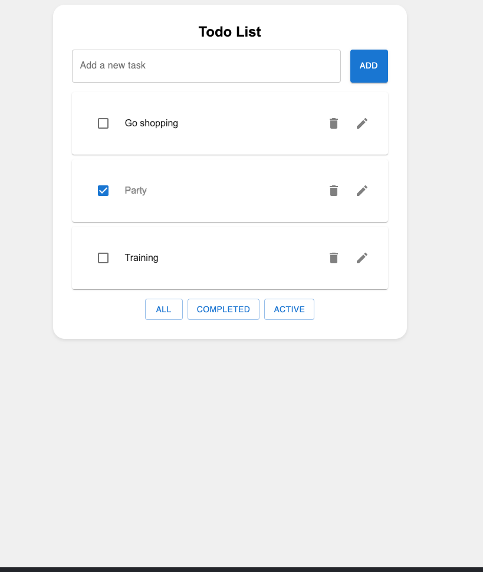

# Minimalist ToDo App

A simple and elegant ToDo List application built using React, leveraging hooks like useState and useEffect, and enhanced with Material UI library for a sleek user interface.

img1.png

## Features

- Add new tasks to your ToDo list
- Edit task titles directly for quick updates
- Mark tasks as completed or active with ease
- Filter tasks by All, Completed, or Active
- Toggle between light and dark themes for personal preference

## Technologies Used

- React: A JavaScript library for building user interfaces.
- Material UI: A popular React UI framework for creating beautiful and responsive designs.
- Styled Components: A CSS-in-JS library for dynamic styling.
- Local Storage: Store tasks locally to ensure persistence between sessions.

